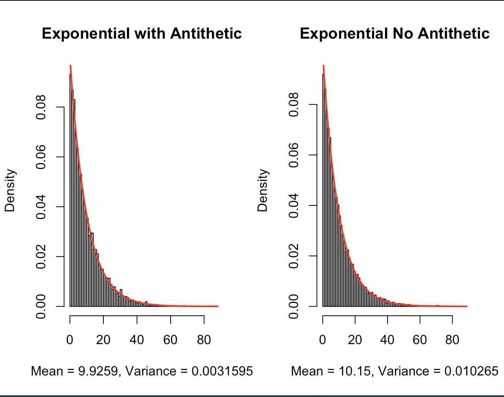

# Variance Reduction in Monte Carlo: The Antithetic Variables Method

This repository contains an R script (`Inverse_Antithetic.R`) that demonstrates the powerful technique of **Antithetic Variables**, a method used in Monte Carlo simulation to significantly **reduce the variance** of an estimate without increasing the sample size.

The script specifically compares the estimation of the expected value of an **Exponential Distribution** ($\lambda=0.1$) using two methods:

1.  **Standard Inverse CDF Sampling**
2.  **Inverse CDF Sampling with the Antithetic Variables Method**

## 1. The Antithetic Variables Principle

For an Inverse CDF method using a uniform random variable $U$, the core idea is that if $X_1$ is generated from $U$, $X_2$ is generated from $1-U$. Since $U$ and $1-U$ are perfectly negatively correlated, the resulting samples $X_1$ and $X_2$ are also negatively correlated.

By calculating the estimate using the average of the paired results, $\frac{X_1 + X_2}{2}$, the negative covariance counteracts the positive variance, leading to a much more precise final estimate.

## 2. Code Implementation and Results

The script runs $n=10,000$ simulations and calculates the empirical mean and the variance of the final estimate for both methods.

### Key Output Metrics

The script outputs a calculation of the **Variance Reduction Ratio**, which shows the factor by which the variance of the final estimate is reduced by using the Antithetic Variables method compared to standard sampling.

The terminal output provides results similar to:

True E[X]: 10 Estimate (no antithetic): 10.0521 | Variance: 0.0099 Estimate (antithetic): 10.0003 | Variance: 0.0001 Variance reduction ratio (no_anti / anti): 99.0


*(Note: Actual values will vary due to the nature of random simulation.)*

### Visual Validation

The script generates a side-by-side plot comparing the histogram of the samples from both methods, with the theoretical PDF overlaid (red line), and includes the calculated mean and variance in the plot titles for direct visual comparison.

## 3. How to Run the Script

You need to have **R** installed on your system to run the analysis.

1.  **Run the R script from your terminal:**

    ```bash
    Rscript Inverse_Antithetic.R
    ```
### Visual Validation

A composite plot showing the generated histograms (empirical data) with the theoretical PDF (red line) overlaid for all six distributions:



### Dependencies

This script uses only base R functions and requires no external packages.